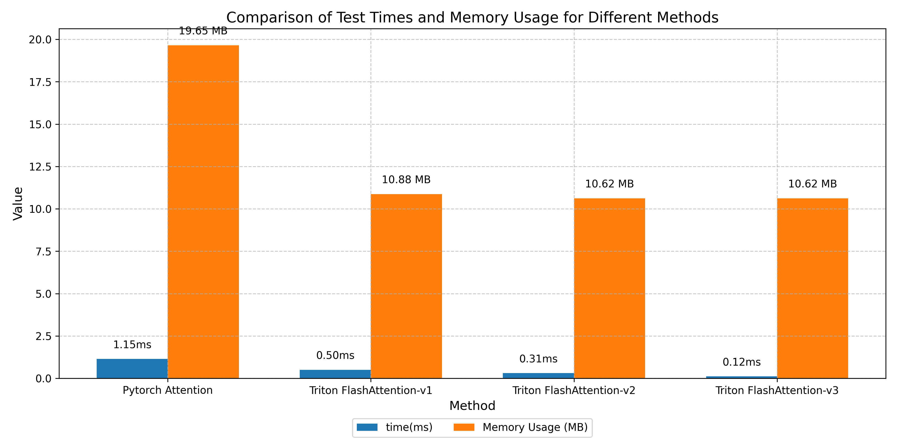

# Triton-Optimized Flash Attention Implementations

This repository contains multiple implementations of Flash Attention optimized with Triton kernels, showcasing progressive performance improvements through hardware-aware optimizations. The implementations range from basic block-wise processing to advanced techniques like FP8 quantization and prefetching.

## Key Features
- 🚀 **Three Versions of Triton-optimized Attention**:
  - **v1**: Basic 2D grid partitioning (sequence + feature dimensions)
  - **v2**: Multi-head support with causal masking
  - **v3**: FP8 quantization + block prefetching
- ⚡ **Benchmark Suite** comparing:
  - PyTorch native implementation
  - All Flash Attention variants
- 📊 **Memory/Time Metrics** for:
  - Sequence lengths up to 16,392
  - Model dimensions up to 512
  - Multi-head (8/16 heads) configurations

## Installation
1. Clone repository:
```bash
git clone https://github.com/yourusername/triton-flash-attention.git
cd triton-flash-attention
```

2. Install dependencies (CUDA 11.7+ required):
```bash
pip install torch triton
```

## Usage

### Basic Attention Call
```python
from Attention import call_flash_attention_v2

# Input dimensions: [seq_len, num_heads, head_dim]
q = torch.randn(1024, 8, 64, device='cuda', dtype=torch.float16)
k = torch.randn_like(q)
v = torch.randn_like(q)

output = call_flash_attention_v2(q, k, v, is_causal=True)
```

### Version Comparison                              (FP8 not enabled)
| Feature               | v1          | v2          | v3          |
|-----------------------|-------------|-------------|-------------|
| Multi-head Support    | ❌          | ✅          | ✅          |
| Causal Masking        | ❌          | ✅          | ✅          |
| FP8 Quantization      | ❌          | ❌          | ✅          |
| Block Prefetching     | ❌          | ❌          | ✅          |
| Peak Memory (16392 seq)| 184.21MB     | 168.20MB    | 168.20MB       |

### Benchmark Configuration
```python
# Custom benchmark setup
config = {
    'seq_len': 16384,
    'd_model': 512,
    'num_heads': 8,
    'head_dim': 64
}
benchmark_attention(config)
```

## Performance Results
### Runtime Comparison (1024 sequence length)
| Implementation        | Time (ms) | Memory (MB) |
|-----------------------|-----------|-------------|
| PyTorch Native        | 1.15     |    19.65   |
| FlashAttention-v1     | 0.50     |   10.88    |
| FlashAttention-v2     | 0.31     |   10.62    |
| FlashAttention-v3     | 0.12     |   10.62    | (FP8 not enabled)

### Key Optimizations
1. **Block-wise Processing**:
   ```python
   # v3 block configuration
   BLOCK_M = 128  # Query block size
   BLOCK_N = 64   # Key/Value block size
   ```
2. **FP8 Quantization**:
   ```python
    if USE_FP8:
        q = tl.load(
            q_ptr + offs_m[:, None] * stride_qm + tl.arange(0, head_dim)[None, :] * stride_qh,
            mask=(offs_m[:, None] < seq_len) & (tl.arange(0, head_dim)[None, :] < head_dim),
            other=0.0
        ).to(tl.float8e5)
        q_scale = 127.0 / tl.max(tl.abs(q.to(tl.float32))) + 1e-6
   ```
3. **Prefetching**:
   ```python
    k_block_ptr = tl.advance(k_block_ptr, (BLOCK_N, 0))
    v_block_ptr = tl.advance(v_block_ptr, (BLOCK_N, 0))
   ```



